# 在 VSCode 使用 Docker 进行开发

## 安装插件

- [Docker](https://marketplace.visualstudio.com/items?itemName=ms-azuretools.vscode-docker) for Visual Studio Code

- [Dev Containers](https://marketplace.visualstudio.com/items?itemName=ms-vscode-remote.remote-containers) 


## 开发方式选择

在 VSCode 中使用 Docker 进行开发，有两种方式：

第一种是仅依赖 [Docker](https://marketplace.visualstudio.com/items?itemName=ms-azuretools.vscode-docker) 插件进行开发，参考 [“使用 Dockfile 插件开发](#使用-dockfile-插件开发) 部分，但是这种方式存在一定的缺点，在 [“使用 Dockfile 插件开发的缺点](#使用-dockfile-插件开发的缺点) 部分

另外一种方式是基于 [Dev Containers](https://marketplace.visualstudio.com/items?itemName=ms-vscode-remote.remote-containers) 插件进行开发，参考 [“使用 Dev Containers 插件开发”](#使用-dev-containers-插件开发) 部分，这种方式提供了更好的开发体验，但是需要进行一些配置

> [!TIP]
> 如果只是为了快速开发，可以跳过 [“使用 Dockfile 插件开发](#使用-dockfile-插件开发) 部分，直接参考 [“使用 Dev Containers 插件开发”](#使用-dev-containers-插件开发) 的步骤搭建开发环境

## 使用 Dockfile 插件开发

首先我们需要编辑一个 `Dockerfile` 文件，可以放置在项目的根目录下，也可以放置在一个 `dockerfiles` 目录下，这里以放置在 `dockerfiles` 目录下为例

如果说你只需要一个操作系统的话，那么 `Dockerfile` 文件内容仅包含一行即可，如下：
```dockerfile
FROM ubuntu:latest
```

选择 Dockerfile 文件，右键选择 `Build Image` 构建镜像

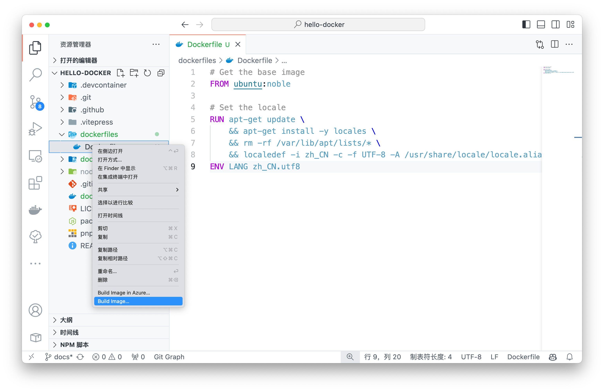

在弹出的对话框中输入镜像名称和标签，例如 `ubuntu-development:latest`，按下 `Enter` 键开始构建镜像


在终端中可以看到构建过程，构建完成后会在左侧的 `Images` 中看到构建的镜像，这时候实际上运行的是 `docker build` 命令，因此也可以手动执行下面的命令构建镜像

```bash
docker build --pull --rm -f "dockerfiles/Dockerfile" -t ubuntu-development:latest "dockerfiles" 
```

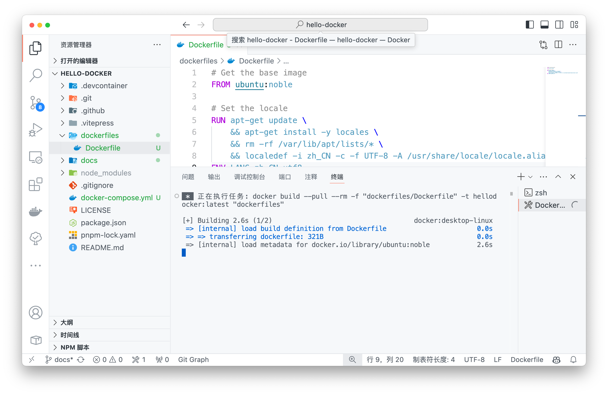

在左侧的 Docker 插件（小鲸鱼🐳图标）的 IMAGES 可以看到刚才构建的镜像，但是，然后这时候可以右键选择 `Run` 运行容器，实际上运行的是 `docker run` 命令，因此也可以手动执行

```bash
docker run --rm -d  ubuntu-development:latest
```

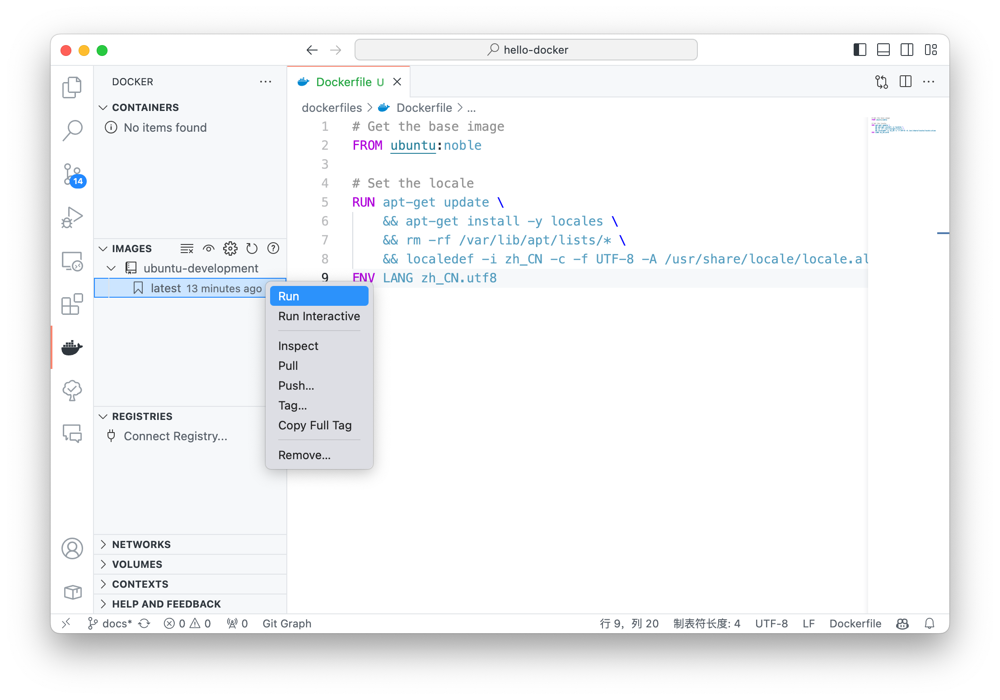

但是，点击退出后发现无法开发，实际上没有将该容器进行守护运行，但是这个插件貌似不太支持这样操作，因此可以在终端中手动执行下面的命令

```bash
docker run --rm -it -d ubuntu-development:latest
```

执行后可以发现，容器(CONTAINER)出现了一个容器，这时候可以右键选择 `Attach Visual Studio Code` 

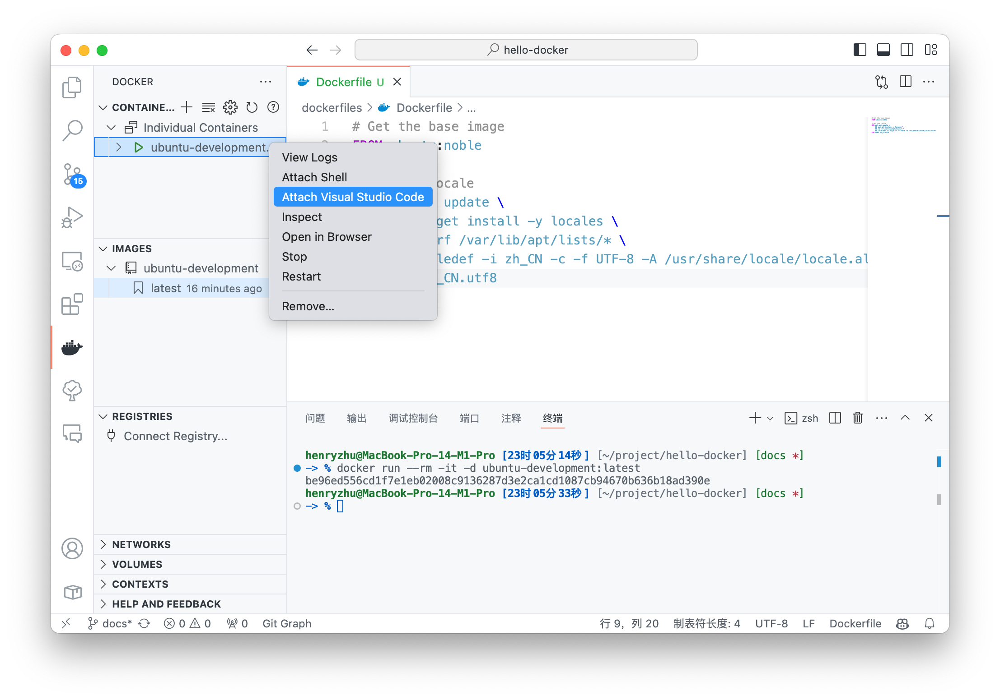

然后就会弹出新窗口，这时候需要选择文件夹，就可以在容器中进行开发了

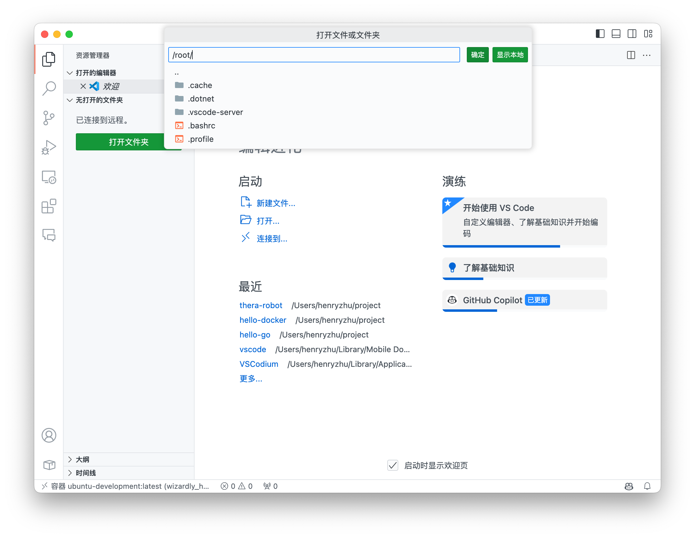

可以看到，已经在容器环境中了，可以理解成远程开发，但是实际上是在本地的容器中开发

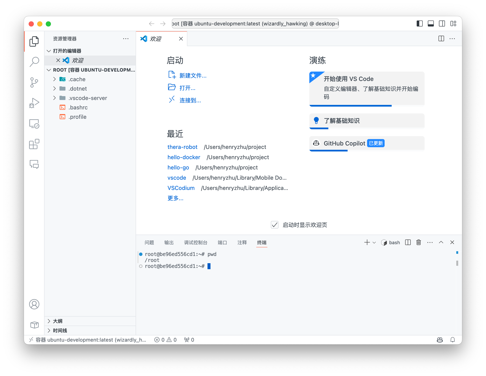

和远程开发一样，需要把 VSCode 的插件安装到容器中，这时候可以在容器中安装插件，左侧选择 `Extensions`，然后在 `容器UBUNTU-DEVELOPMENT` 旁点击云朵图标，安装插件到容器中，就可以在容器内开发了

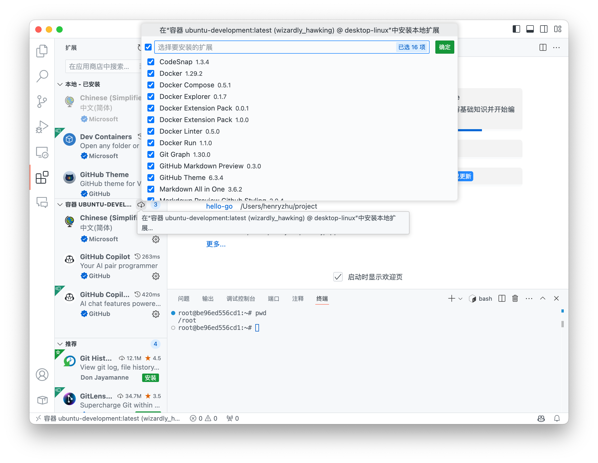

不过这时候发现，其实本地开发的话，代码并不在容器中，因此需要在创建容器的时候挂载本地目录到容器中，这时候可以在 `docker run` 命令中添加 `-v` 参数挂载本地目录到容器中

```bash
docker run --rm -it -d \
    -v ./:/root/project \
    -w /root/project \
    ubuntu-development:latest 
```

然后重复上述的步骤，就可以在容器中开发了

## 使用 Dockfile 插件开发的缺点

```bash
docker run --rm -it -d -v ./:/root/project -w /root/project ubuntu-development:latest 
```

这种方法存在一个问题，无法启动容器并进入容器，需要手动执行容器并守护运行，然后再手动进入容器，这样操作比较繁琐，因此可以使用 Dev Containers 插件进行开发，但是 Dev Containers 需要额外编辑一份 `docker-compose.yml` 文件，因此需要额外的配置，但是 Dev Containers 提供了更好的开发体验


## 使用 Dev Containers 插件开发

### 安装插件
VSCode 可以借助插件 [Dev Containers](https://vscode.github.net.cn/docs/devcontainers/containers) 开发


### 使用 Dev Containers 插件的过程

> 使用 Dev Containers 插件开发过程，可以参考官方文档 [_Create a development container using Visual Studio Code Remote Development_](https://code.visualstudio.com/docs/devcontainers/create-dev-container)


#### Dockerfile 和 docker-compose.yml 文件

安装后，需要准备两个文件，分别是 `dockerfiles/Dockerfile` 和 `docker-compose.yml`

如果说你只需要一个操作系统的话，那么 `Dockerfile` 文件内容仅包含一行即可，如下：
```dockerfile
FROM ubuntu:latest
```

`docker-compose.yml` 文件内容如下
```yaml
services:
  ubuntu-dev:
    build:
      context: .
      dockerfile: dockerfiles/Dockerfile
```

> 文件内容含意这里不详细说明，下面会对此进行解释


#### 打开容器配置文件

点击VSCode （最）左下角「打开远程窗口」，弹出的命令中，点击「打开容器配置文件」

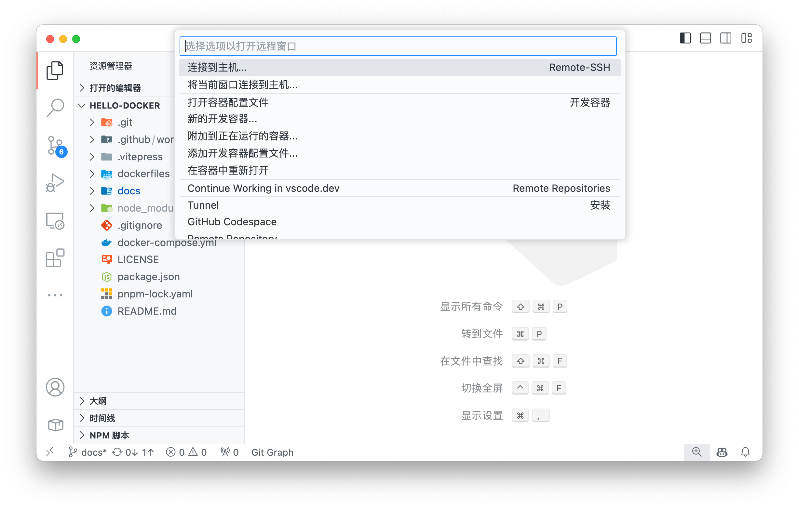

> [!TIP]
> 在 VSCode 中键入 `Ctrl+Shift+P` 调出**命令面板** ，或者在菜单栏中选择 `查看(View)` -> `命令面板(Command Palette)` 调出**命令面板**

也可以在**命令面板**中搜索并执行命令 `Dev Containers: Open Container Configuration File` 打开容器配置文件

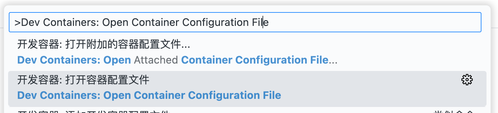


（建议）在工作区级别添加配置文件（`.devcontainer/devcontainer.json`）来配置容器

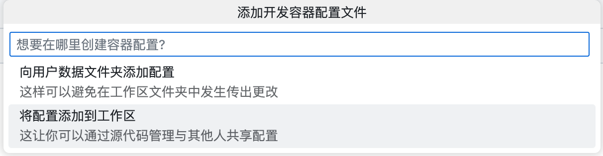

#### 决定创建容器的方式

接下来会选择 `如何创建容器`

  - 【推荐】第一种方法：如果本地有 `Dockerfile` 或者 `docker-compose.yml` 文件，可以选择从这两个文件之一创建容器，因为我们编写了 `docker-compose.yml` 文件，因此选择 `From docker-compose.yml` 创建容器

    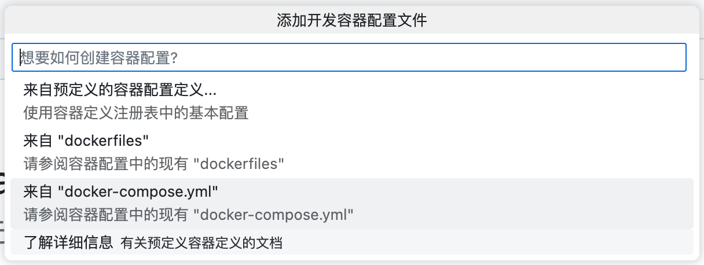

  - 【不推荐】第二种方法：也可以选择 `来自预定义的容器配置定义` 构建容器（但是这样一来， `Dockerfile` 和 `docker-compose.yml` 就白写了）

    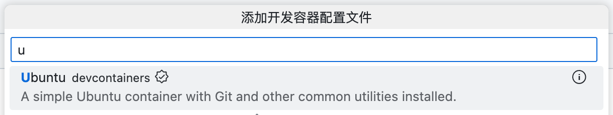


在完成 `如何创建容器` 步骤之后，可以为容器添加额外的功能以便于开发，这些插件可以供开发使用，而不会被包含在 Dockerfile 中，因此不会对部署产生影响。

例如在过程中需要获取一些其他仓库，可以添加 `Git` 和 `Git LFS` 插件

> 如果是第一次参考本文创建开发环境，建议跳过这一步，等开发环境确定创建后再添加，以免出现问题


完成上述操作后，当前目录下会新增如下文件（文件的内容会随后说明）
```shell
.
├── .devcontainer
│   ├── devcontainer.json   # devcontainer 配置文件
│   └── docker-compose.yml  # 额外的 docker-compose 配置文件 (自动生成)
└── .github
    └── dependabot.yml      # 依赖检查配置文件 (生成可选)
```

同时右下角会弹出提示，询问是否 `在容器中重新打开`

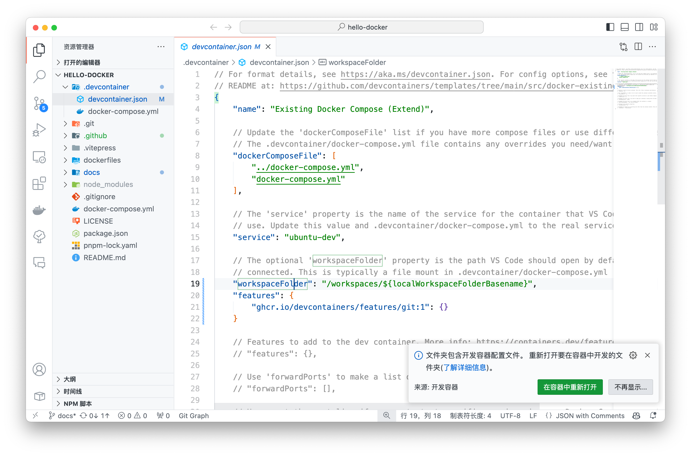

点击 `在容器中重新打开` 后，等待容器创建（需要🪄魔法或配置镜像源）

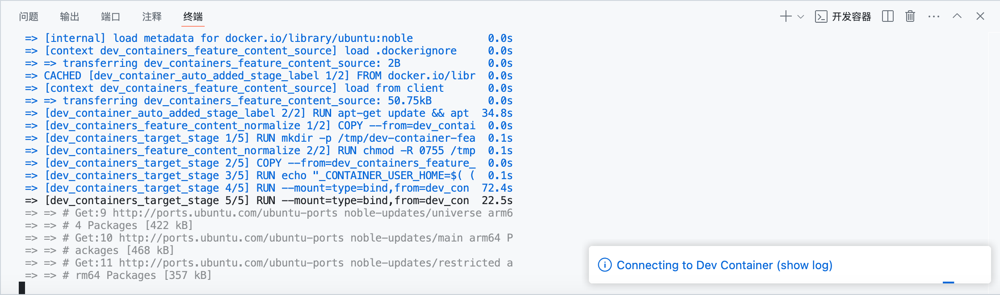

随后会自动打开一个新的窗口，VSCode 会在容器中打开文件夹，可以在容器中开发

🎉 **到此，就可以在容器中开发了**


> [!TIP]
> 在开发中可能会产生一些与开发相关的文件，建议添加到 `.gitignore` 文件中，以避免提交到仓库中
> 
>  ```
>  # --- Dev Containers ---
>  .vscode-server/
>  .dotnet/
>  .cache/
>  ```

#### 修改配置文件并重新构建容器

从上述的步骤可以看出，只需要几个文件就可以在容器中开发，这里再次列出这几个文件

```shell
.
├── .devcontainer
│   ├── devcontainer.json   # devcontainer 配置文件
│   └── docker-compose.yml  # 额外的 docker-compose 配置文件 (自动生成)
├── dockerfiles
│   └── Dockerfile          # 镜像构建文件
└── docker-compose.yml      # 镜像启动文件
```

> [!NOTE]
> ❓ **这里会有一个疑惑，为什么会有两个 `docker-compose.yml` 文件？**
> 
> `docker-compose.yml` 是用来启动容器的，插件 Dev Containers 会根据该文件自动生成扩展文件 `.devcontainer/docker-compose.yml` 文件，扩展文件 `.devcontainer/docker-compose.yml` 文件可以配置一些开发相关的内容，例如挂载本地目录到容器中，这样就可以在容器中开发了
> 
> 可以简单理解为：
> - 1️⃣ 如果需要开发，需要 `docker-compose.yml` 和扩展的一些配置，这些配置在 `.devcontainer/docker-compose.yml` 文件中，两个文件共同构成了「开发环境」
> - 2️⃣ 当开发完成后，只需要 `docker-compose.yml` 文件即可部署应用，而可以不依赖开发扩展的配置文件 `.devcontainer/docker-compose.yml` 文件，这样就可以快速启动而不需冗余的配置，因此 `docker-compose.yml` 文件是「部署环境」
> - 3️⃣ 例如，Git 插件可能只存在与开发过程中，而在部署时并不需要，因此可以在 `.devcontainer/docker-compose.yml` 文件中配置，这样就可以在开发时使用，而在部署时不会被包含在镜像中

可以注意到刚才启动开发容器的新窗口，打开的目录是 `/workspaces/hello-docker`，这就是 devcontainer 配置文件 `.devcontainer/devcontainer.json` 的 `workspaceFolder` 选项指定的路径，可以修改该选项来指定打开的目录

如果希望将当前工作目录挂在到 `/root/project` 中，并且打开的目录为 `/root/project`，需要修改两个文件

- **修改 `.devcontainer/devcontainer.json`** 

修改该文件的 `workspaceFolder` 选项，可以指定打开的目录
```json
// .devcontainer/devcontainer.json
{
    "name": "Existing Docker Compose (Extend)",
    "dockerComposeFile": [
        "../docker-compose.yml"
        "docker-compose.yml"
    ],
    "service": "ubuntu-dev",
    "workspaceFolder": "/workspaces/${localWorkspaceFolderBasename}", // [!code --]
    "workspaceFolder": "/root/${localWorkspaceFolderBasename}",       // [!code ++]
    "postCreateCommand": "cat /etc/os-release"
}
```
> `${localWorkspaceFolderBasename}` 是 VSCode 中的变量，表示当前工作目录的基本名称，例如 `hello-docker`，`/root/${localWorkspaceFolderBasename}` 表示将当前工作目录挂载到 `/root/hello-docker` 中

- **修改 `.devcontainer/docker-compose.yml` 文件**

修改该文件的 `volumes` 参数，将当前工作目录挂载到 `/root` 中
```yml
# .devcontainer/docker-compose.yml
version: '3.8'
services:
  ubuntu-dev:
    volumes:
      - ..:/workspaces:cached   # [!code --]
      - ..:/root:cached         # [!code ++]
    command: sleep infinity
```

> - `volumes` 选项用来挂载本地目录到容器中，`..` 表示上级目录，`/workspaces` 表示挂载到容器中的目录，`cached` 表示缓存，可以提高性能
> - `command: sleep infinity` 是一个非常重要的参数，表示容器启动后执行 `sleep infinity` 命令，保持容器一直运行，否则在容器启动后会立即退出，使得远程连接到容器的过程报错

如果修改了 `Dockerfile` 或者 `docker-compose.yml` ，或者上述的配置修改后，需要重启容器以使得修改生效

以在**命令面板**中选择 `Dev Container: Rebuild Container` 重建容器，推荐 `Without Cache`（不适用缓存）选项重新构建容器，以确保修改生效


等待构建完成后就可以看到，当前打开的目录已经是 `/root/project` 了，并且工程文件已经挂在到了容器中，可以在容器中开发了

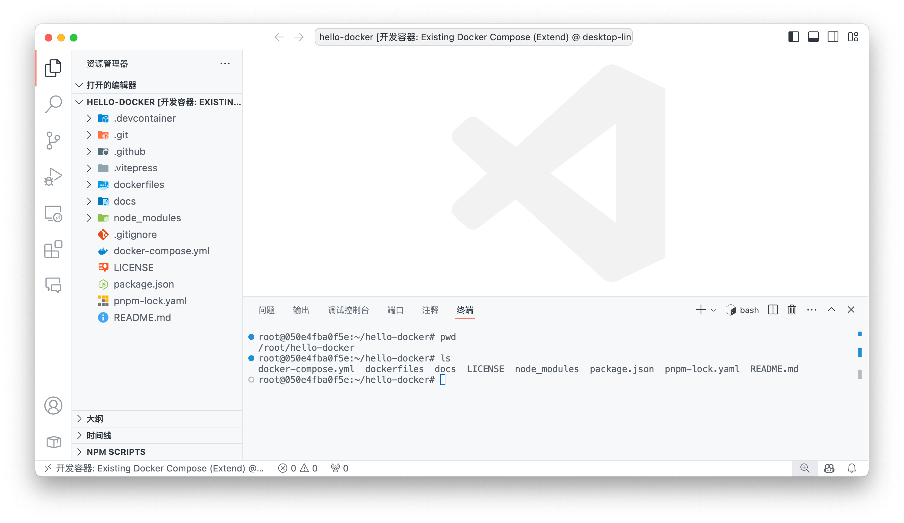

和远程开发一样，需要把 VSCode 的插件安装到容器中，这时候可以在容器中安装插件，左侧选择 `Extensions`，然后在 `容器UBUNTU-DEVELOPMENT` 旁点击云朵图标，安装插件到容器中，就可以在容器内开发了


到此为止，就可以很丝滑地在容器中开发了，与本地开发并无二致，也不需要安装操作系统了

接下来就该详细说明一下配置文件的内容了

#### 配置文件说明

配置文件 `.devcontainer/devcontainer.json` 的细节可以参考 [_Dev Container Templates reference_](https://containers.dev/implementors/templates/) 文档

<!-- #### docker-compose.yml 文件说明 -->

<!-- #### Dockerfile 文件说明

目前 `Dockerfile` 文件比较简单，仅包含安装 `Ubuntu` 操作系统
```dockerfile
FROM ubuntu:latest
``` -->


<!-- #### 实际执行的命令

实际上有了 `Dockerfile` 和 `docker-compose.yml` 文件后，稍微记一下命令就可以很方便开发了

和上面一样，还是 `dockerfiles/Dockerfile` 和 `docker-compose.yml` 两个文件，文件内容保持一直，可以使用 `docker compose` 命令启动容器，并添加 `-d` 参数守护运行，这样容器就可以一直运行在后台

```bash
# docker compose build 
docker compose up -d
docker compose up -d [--project-name ubuntu-development]

# docker compose down
# docker compose up -d  --force-recreate
``` 

> - 在以前的版本中，需要使用 `docker-compose` 命令，新版本的 Docker 已经集成了 `docker compose` 命令，因此可以直接使用如上

> - 不需要执行 `docker compose build` 命令，因为如果容器不存在，`docker compose up` 命令会自动构建容器z s

以上 -->


## 资料

- [Docker — 从入门到实践](https://yeasy.gitbook.io/docker_practice/install/ubuntu) ([github](https://github.com/yeasy/docker_practice))
- [Docker Tips (Docker笔记)](https://dockertips.readthedocs.io/en/latest) ([永久域名](https://www.docker.tips))
- [_Create a development container using Visual Studio Code Remote Development_](https://code.visualstudio.com/docs/devcontainers/create-dev-container)：使用 Dev Containers 插件进行开发的官方文档
- [_Dev Container Templates reference_](https://containers.dev/implementors/templates/)：Dev Containers 配置文件的细节文档