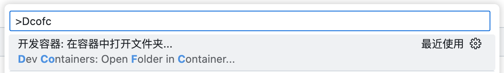
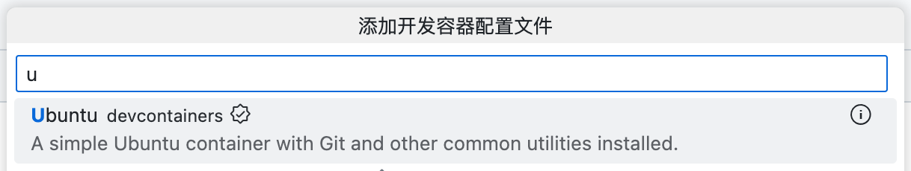
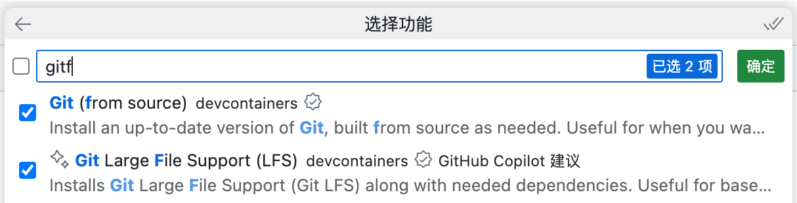
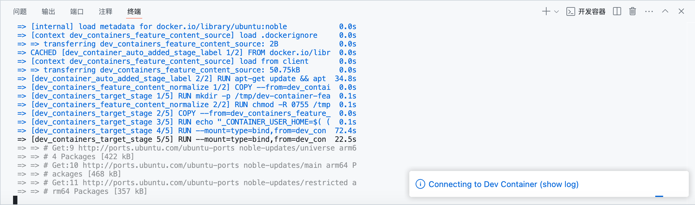
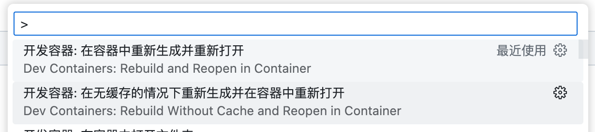
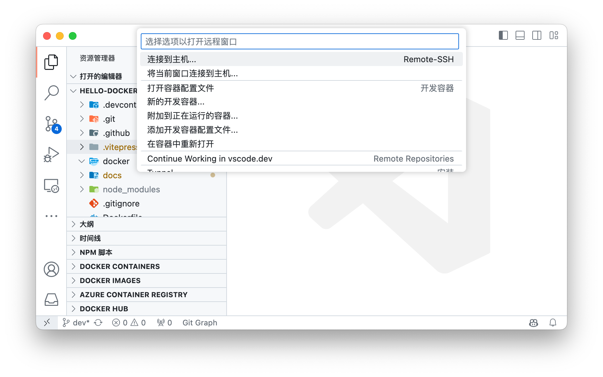

# Docker 环境准备

## Docker 文档

- [docker.docs](https://docs.docker.com): Docker 官方文档

## Docker 安装

Docker 有两种安装方式
- **Docker Engine**: 也叫 **Docker CE**， 适用于 Linux 系统，仅支持命令行操作
- **Docker Desktop**: 适用于 Mac、Windows、Linux 系统，支持图形界面操作

### Docker Engine

Docker Engine 支持 [Ubuntu](https://docs.docker.com/engine/install/ubuntu/)、[Debian](https://docs.docker.com/engine/install/debian/)、[CentOS](https://docs.docker.com/engine/install/centos/) 等 Linux 发行版本。

例如在 Ubuntu 上[使用 apt 安装 Docker Engine](https://docs.docker.com/engine/install/ubuntu/#install-using-the-repository)

```bash
# Add Docker's official GPG key:
sudo apt-get update
sudo apt-get install ca-certificates curl
sudo install -m 0755 -d /etc/apt/keyrings
sudo curl -fsSL https://download.docker.com/linux/ubuntu/gpg -o /etc/apt/keyrings/docker.asc
sudo chmod a+r /etc/apt/keyrings/docker.asc

# Add the repository to Apt sources:
echo \
  "deb [arch=$(dpkg --print-architecture) signed-by=/etc/apt/keyrings/docker.asc] https://download.docker.com/linux/ubuntu \
  $(. /etc/os-release && echo "$VERSION_CODENAME") stable" | \
  sudo tee /etc/apt/sources.list.d/docker.list > /dev/null
sudo apt-get update
```

安装 Docker Engine

```bash
sudo apt-get install docker-ce docker-ce-cli containerd.io docker-buildx-plugin docker-compose-plugin
```

### Docker Desktop

[Docker Desktop](https://docs.docker.com/get-started/get-docker/) 支持 [Mac](https://docs.docker.com/desktop/install/mac-install/)、[Windows](https://docs.docker.com/desktop/install/windows-install/) 和 [Linux](https://docs.docker.com/desktop/install/linux-install/)，其中Linux 不同发行版本安装方式不同，支持 [Ubuntu](https://docs.docker.com/desktop/install/ubuntu/)、[Debian](https://docs.docker.com/desktop/install/debian/) 等。


## Docker 配置

### 镜像加速

编辑 `/etc/docker/daemon.json` 文件，添加如下内容：

```json
{
  "registry-mirrors": ["https://registry.docker-cn.com"]
}
```

> [!TIP]
> - Docker Desktop 可以在 `Settings` -> `Docker Engine` 中配置
> - 2024年6月初，国内镜像服务不再提供服务，需要自己找一些可用的镜像服务。

重新加载 systemd 守护进程并重启 Docker（systemd 系统）。对于 Desktop 版本，重启 Docker Desktop 即可。

```bash
sudo systemctl daemon-reload
sudo systemctl restart docker
```


## Docker Hub 注册

在 [Docker Hub](https://hub.docker.com) 注册一个账号，可以在 Docker Hub 上发布自己的镜像。

```bash
docker push <username>/<repo>:<tagname>
```


## VSCode 使用

VSCode 可以借助插件 [Dev Containers](https://vscode.github.net.cn/docs/devcontainers/containers) 开发

> [!TIP]
> 在 VSCode 中键入 `Ctrl+Shift+P` 调出**命令面板** ，或者在菜单栏中选择 `查看(View)` -> `命令面板(Command Palette)` 调出**命令面板**

在**命令面板**中搜索并执行命令 `Dev Containers: Open Folder in Container` 当前目录作为容器的启动目录



（建议）在工作区级别添加配置文件（`.devcontainer/devcontainer.json`）来配置容器


接下来会选择 `如何创建容器`

1. （推荐）如果本地有 `Dockerfile` 或者 `docker-compose.yml` 文件，可以选择从 `Dockerfile` 或 `docker-compose.yml` 创建容器


2. 也可以选择 `来自预定义的容器配置定义` 构建容器




随后可以为容器添加额外的功能以便于开发，这里添加了 `Git` 和 `Git LFS` 作为示例



等待容器创建（需要🪄魔法或配置镜像源）



随后会自动打开一个新的窗口，VSCode 会在容器中打开文件夹，可以在容器中开发

如果修改了 `Dockerfile` 或者 `docker-compose.yml` ，可以在**命令面板**中选择 `Dev Container: Rebuild Container` 重建容器，推荐 `Without Cache`（不适用缓存）选项重新构建容器，以确保修改生效



此外在左下角，也可以将容器以远程开发的方式打开，这样可以在容器中开发，与远程连接到服务器并无二致，是一种轻量级的远程开发方式（强烈推荐以这种方式开发）


## 资料

- [Docker — 从入门到实践](https://yeasy.gitbook.io/docker_practice/install/ubuntu) ([github](https://github.com/yeasy/docker_practice))
- [Docker Tips (Docker笔记)](https://dockertips.readthedocs.io/en/latest) ([永久域名](https://www.docker.tips))